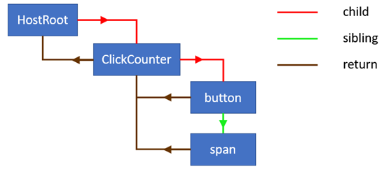

## 1. fiber的由来

FB创造fiber的目的是为了使用户交互更流畅。

### 1.1 同步reconciler过程
在fiber以前reconciler是同步执行的，一旦reconcile开始就不能中断，直到所有的render函数执行完毕。
在页面元素复杂的情况下，render函数的数量众多，同步执行可能导致用户交互出现卡顿。

### 1.2 异步reconciler过程
在fiber中，每一个节点对应一个fiber，遍历fiber就可以完成reconciler过程。而fiber的遍历采用的是循环遍历，而不是以前的递归式遍历。也就是说fiber的遍历是可以中断的，并且中断后还可以继续执行未完成的reconcile。
react吧整个vdom的reconcile分解到多个时间片中执行，从而避免了动画的卡顿。

### 1.3 render阶段 commit阶段
react的更新过程可以分为两个阶段。其中render阶段是可以中断的，reconciler过程在这个阶段中。而commit过程是不可中断的，这个阶段主要是做host元素修改。
也就是说如果在第二阶段发生大量元素更新仍会导致交互失去响应。

### 1.4 concurrent react能解决什么问题？
- 避免低优先级任务占据主线程，从而导致交互失去响应。分片执行低优先级任务的render方法。
- 延后执行低优先级方法的执行。调换任务执行的顺序。

### 1.5 fiber遍历过程

- child: 第一个孩子
- sibling: 其它的孩子
- return: 父亲

遍历的规则
- 输出当前节点
- 如果当前节点有child则转到child
- 如果当前节点没有child
  - 如果有sibling则转到sibling
  - 如果没有sibling则返回最近一个有sibling的父亲
    - 如果父亲是根节点则遍历结束

整个遍历的过程不包含递归。只要保存当前节点就可以中断和恢复遍历。

---
参考文献
- [Scheduling in React](https://philippspiess.com/scheduling-in-react/)